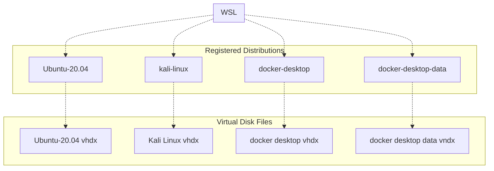
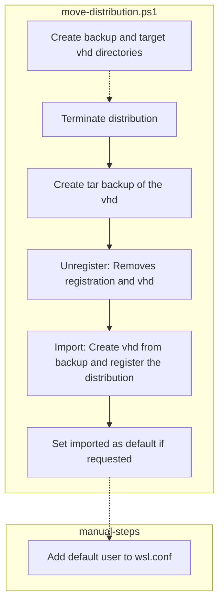

# DISCLAIMER
Code in this repository is without Warranty.

The move script will terminate and unregister your existing WSL instances.  This is a destructive operation that could leave you with no WSL instance if the backup failed. The script attempts to catch this but there may be situations where backup failure is not detected. 

# Purpose
The scripts in this directory manipulate WSL2.
* `move-distribution.ps1` will move a WSL instance from one location to a new one using the `wsl export` function.


# Moving a WSL2 distribution
The move operation is comprised of main steps



# Using this script
Edit this section of `move-distribution.ps1` and change the parameters to fit your needs. 
* Pay **special** attention to the `$ExecuteUnregisterImport` parameter.  
* Leave `$ExecuteUnregisterImport` set to `false` for your first test run.
* Make sure you have enough disk space for the .tar file and the vhdx in the places you locate them. Ex:
    * Fresh Kali is a 500k tar file
    * Fresh Kali with Kex is a 3GB tar file
    * Full Kali is an 18GB tar file.
    * Fresh Ubuntu is 1.6GB

The latest and most correct param list is in `move-distribution.ps1`. The param shown here may be out of date.
```dotnetcli
param (
    # the originating WSL distribution name
    [String]$WslSourceName = "kali-linux",                       

    # the target locaton for the distribution backup
    [String]$ExportDir = "I:\wsl-export",                       
    # the filename of the backup - no overwrite
    [String]$WslExportName = 
    "$WslSourceName-$(get-date -f yyyyMMdd-HHmmss).tar",    

    # the target location for the new distribution vhdx file
    [String]$DestDir = "I:\wsl",                                 
    # the destination WSL distribution name defaults to src
    [String]$WslDestName = $WslSourceName,                        
    # make this new distribution the default distribution
    [boolean]$WslDestAsDefault = $true,                           

    # execute all steps but just log unregister and import if false
    [boolean]$ExecuteUnregisterImport = $false                  
)
```

# Things that are lost when moving a registration location

## The distribution.exe file no longer exists.
The WSL installation process creates a `<distribution>.exe` file for each distribution. You can use that command similarly to the wsl command.
Regaining that .exe file involves thinking and registry works.

## The default user selection is lost
The default user when opening a connection becomes `root`.
You can reset the default user for Linux Distributions.
The import operation will lose the default user resulting in all shells opening as root. That binding is actually stored in a windows registry entry. 

### Simple fix
Edit the file `/etc/wsl.conf` in each imported system and add the following section.  
Some distributions like `Ubuntu` will already have sections in the file. In that case, just append this content.

```
[user]
default=<your_username>
```
This change has the added benefit that all later moves will have the write default user because `/etc/wsl.conf` becomes part of the migration backup.

**Steps**
1. Add the content to `/etc/wsl.conf` as `root`
1. Terminate the wsl distribution with `wsl --terminate <distribution-name>` 
1. Wait 8 seconds
1. Open a new terminal into that distribution.

### Explanation - Windows registry link was broken
The default UID is `0` which you can see with the output of 
```
Get-ChildItem HKCU:\Software\Microsoft\Windows\CurrentVersion\Lxss\
```
* Ref: https://askubuntu.com/questions/1427355/why-has-my-ubuntu-started-defaulting-to-root-user-on-startup-duel-running-wind

### Explanation - can't fix with instance command
You cannot run `<instance>.exe config --default-user <username>` because the .exe link isn't made with an import


# Todo Items
1. Add a backup _only_ script for snapshoting wsl instances or make flags easier to use. Currently supported via `$ExecuteUnregisterImport=$false`
1. Add ability to remove the backup tar file when done.  Currently leaves in place
1. Add ability to create a backup and unregister without a following import.
1. Add ability to update the default user from `UID=0` / `root` to something else using `wsl.exe` edit to `/etc/wsl.conf`file 
1. Move Powershell param docs into doc block so that `help` command works.

## Completed Todo Items
1. Added return codes on all early exit paths
1. Add a `$ExecuteUnregisterImport` parameter that doesn't execute the destructive commands _complete 2023/06_
1. Add set as default _complete 2023/06_

# Adding GUI to Distributions

## Kali Linux Hints with WSLg

Install and execute as you
```bash
# install kex
sudo apt update
sudo apt upgrade
sudo apt install -y kali-win-kex
# Jack up the install to everything
sudo apt install -y kali-linux-large
# Start it up
kex --win -s
```

Execute as you from Windows
```dotnetcli
wsl -d kali-linux kex --win -s
```

* Ref: https://www.kali.org/docs/wsl/win-kex/

# Ubuntu
_Just use Kali if you want a linux desktop_ 

Install and execute as you
```bash
# install kex
sudo apt-get update
sudo apt-get upgrade
# ????
# sudo apt install -y ??
# Start it up
# ????
```

* Ref: https://github.com/microsoft/wslg
* Ref: I agree with https://ubunlog.com/en/como-instalar-ubuntu-con-interfaz-grafica-en-windows-gracias-a-wsl2-o-mejor-aun-kali-linux/

# WSL cheat sheet
* `wsl ~ -d <distribution>` starts the distribution and connects as default user Ex:`wsl ~ -d kali-linux`
* `wsl ~ -d <distribution> -u root`  starts the distribution and connects as root Ex:`wsl ~ -d kali-linux -u root`
* `wsl -d <distribution> -u root <command>` starts the distribution and runs command as root Ex:`wsl -d kali-linux -u root cat /etc/wsl.conf`
* `wsl --setdefault <distribution>` sets the default distribution name Ex: `wsl --setdefault kali-linux`
